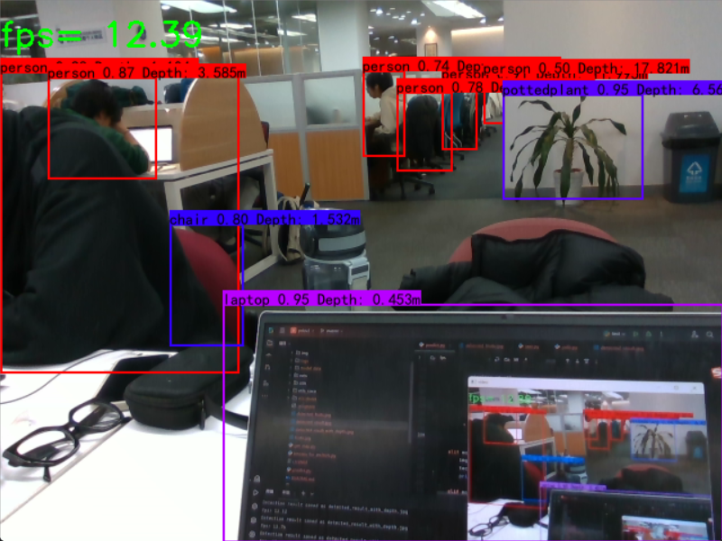

# Real-Time Object Detection with Depth

Real-time object detection and 3D coordinate extraction using **YOLOv5** and **Intel RealSense D435**, designed as a perception front-end for robotic arm grasping.

---

## Example

---

## Overview

This project integrates YOLOv5 with the Intel RealSense D435 depth camera to:

- Detect objects in real time from RGB images
- Use the aligned depth map to compute **3D coordinates** of detected targets
- Provide these 3D positions as input for downstream **robotic arm grasping** or other manipulation tasks

---

## Key Features

- 🔍 **Real-time object detection** with YOLOv5  
- 📏 **Depth-aware 3D localization** using Intel RealSense D435  
- 🤖 **Robot-ready output** for grasp planning and control  
- 🧩 Modular design: easy to plug into existing robotics pipelines

---

## Requirements

- Python 3.x  
- PyTorch + YOLOv5 dependencies  
- Intel RealSense SDK (librealsense) and Python bindings  
- A connected Intel RealSense D435 camera

---
